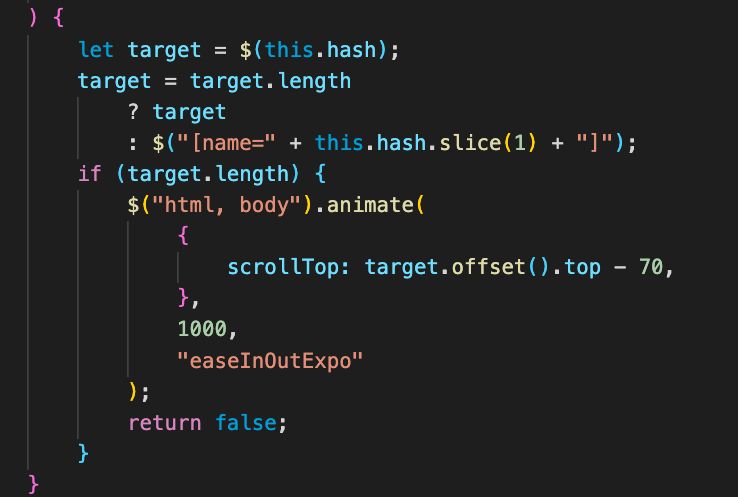

 
 <h1 align="center"> Responsive Portfolio</h1>

## Description:

Welcome to my portfolio. The goal of this project is to create an useful and responsive website. To create a mobile website, we need to utilize the Boostrap applications and incorporate different CSS elements.

The  Bootstrap application helps make sure to have a functional website. I  used the appropriate grid system (containers, rows, and columns).

### Visuals:

To have the right validation code in all my HTML pages I used this website: https://validator.w3.org

### Badges:
 
 

### Installation:

The installation I used to make sure the development environment is running efficiently. I make sure to install this program below:

* Terminal
* Visual Studio Code
* [GitHub](https://github.com/adpir/Professional-Portfolio)
* [GitHubPages](https://adpir.github.io/Professional-Portfolio)
* Git Lab

### Usage:
This page could be used as a starting place for making a web page accessible.

### Contributing:
Pull requests are welcome. For major changes, 
please open an issue first to discuss what you would like to change. 
Please make sure to update tests as appropriate.

### License:

Copyright  © 2020 Alice Piar University of Minnesota BootCamp All rights reserved.

